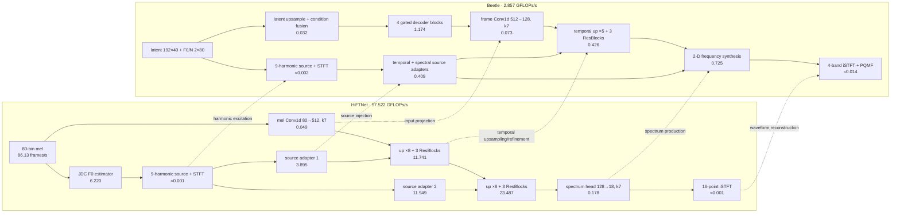

# HiFTNet vs. Beetle decoder: layer-by-layer compute

## Result

For one second of output audio, the checked-in configurations require:

| Decoder path | Dense GFLOPs/s of audio | Transform/PQMF estimate | Estimated total |
|---|---:|---:|---:|
| HiFTNet, including its internal JDC F0 estimator | 57.520 | 0.002 | **57.522** |
| HiFTNet, excluding its internal JDC F0 estimator | 51.300 | 0.002 | **51.301** |
| Beetle `Decoder` + `Generator` | 2.840 | 0.016 | **2.857** |

On this arithmetic model, the complete HiFTNet path is **20.25×** the Beetle
path. Removing HiFTNet's internal F0 estimator still leaves its synthesis path
**18.06×** as expensive. These numbers describe operation count, not measured
wall-clock throughput.

The comparison uses the repository defaults:

- HiFTNet: 22,050 Hz, 256-sample mel hop, 80 mel channels, two `×8`
  upsampling stages, 16-point output iSTFT.
- Beetle: 24,000 Hz, 300-sample output hop, 40 latent frames/s, 80 decoder
  frames/s, `×5` temporal upsampling, four-band 60-point iSTFT.

## Matched architecture

Solid arrows are the synthesis path. Dotted horizontal arrows mark the closest
functional match; they do not imply identical tensors or algorithms.

## Functional layer matching

| Function | HiFTNet layer/submodule | GFLOPs/s | Beetle layer/submodule | GFLOPs/s | Match |
|---|---|---:|---|---:|---|
| F0 prediction | `F0_model` (JDCNet) | 6.220 | Outside this boundary; F0 is passed into `Decoder` | — | No |
| Latent decoding | No latent decoder; mel is the direct input | — | `latent_upsample` + `conditioning_projection` + `refinement` | 1.206 | No |
| Frame projection | `conv_pre`, 80→512, k7 at 86.13 Hz | 0.049 | `input_projection`, 512→128, k7 at 80 Hz | 0.073 | Functional |
| Harmonic excitation | `m_source`, nine sines merged to one | 0.0004 | `harmonic_features.source`, nine sines merged to one | 0.0004 | Close |
| Source analysis | 16-point STFT at 5,512.5 frames/s | ≈0.0009 | 240-point STFT at 400 frames/s | ≈0.0019 | Functional |
| Temporal upsampling | two ConvTranspose1d stages, ×8 then ×8 | 1.084 | one ConvTranspose1d stage, ×5 | 0.013 | Functional |
| Temporal refinement | six parallel-path ResBlocks | 34.144 | three parallel ResBlocks | 0.413 | Close |
| Source adaptation | two 1-D adapters and two ResBlocks | 15.844 | temporal and 2-D spectral adapters | 0.409 | Functional |
| Spectrum production | one 1-D 128→18 head | 0.178 | 2-D frequency entry, shuffles, upsamples, refinement, band heads | 0.725 | Functional |
| Waveform synthesis | external 16-point iSTFT | ≈0.0009 | four 60-point iSTFTs + PQMF synthesis | ≈0.0143 | Functional |

The largest architectural difference is where refinement happens. HiFTNet runs
wide 1-D convolutions after expanding to roughly 689 and then 5,513 frames/s.
Beetle keeps temporal refinement at 400 frames/s and constructs its 31 frequency
bins with narrower 2-D layers.

## HiFTNet layers

The shape column is batch-free and normalized to the traced 86-frame input.
Repeated convolution costs are combined only where the repeated modules have
identical shapes.

| Layer/submodule | Shape or composition | GFLOPs/s |
|---|---|---:|
| `F0_model.conv_block[0]` | 1×86×80 → 64×86×80, k3×3 | 0.008 |
| `F0_model.conv_block[3]` | 64×86×80 → 64×86×80, k3×3 | 0.508 |
| `F0_model.res_block1` | two k3×3 convs + 1×1 skip, frequency 40 | 1.581 |
| `F0_model.res_block2` | two k3×3 convs + 1×1 skip, frequency 20 | 1.990 |
| `F0_model.res_block3` | two k3×3 convs + 1×1 skip, frequency 10 | 1.863 |
| `F0_model.bilstm_classifier` | 512→256×2, 86 steps | 0.271 |
| `F0_model.classifier` | 512→1, 86 steps | 0.0001 |
| `conv_pre` | 80×86 → 512×86, k7 | 0.049 |
| `m_source.l_linear` | 9→1 at 22,050 Hz | 0.0004 |
| `noise_convs[0]` | 18×5,505 → 256×688, k16/s8 | 0.102 |
| `noise_res[0]` | six 256→256 k7 convs at 688 frames | 3.793 |
| `ups[0]` | 512×86 → 256×688, k16/s8 | 0.361 |
| `resblocks[0]` | six 256→256 k3 convs at 688 frames | 1.626 |
| `resblocks[1]` | six 256→256 k7 convs at 688 frames | 3.793 |
| `resblocks[2]` | six 256→256 k11 convs at 688 frames | 5.961 |
| `noise_convs[1]` | 18×5,505 → 128×5,505, k1 | 0.025 |
| `noise_res[1]` | six 128→128 k11 convs at 5,505 frames | 11.924 |
| `ups[1]` | 256×688 → 128×5,504, k16/s8 | 0.723 |
| `resblocks[3]` | six 128→128 k3 convs at 5,505 frames | 3.252 |
| `resblocks[4]` | six 128→128 k7 convs at 5,505 frames | 7.588 |
| `resblocks[5]` | six 128→128 k11 convs at 5,505 frames | 11.924 |
| `conv_post` | 128×5,505 → 18×5,505, k7 | 0.178 |
| Harmonic STFT | 16-point real FFT, estimated | ≈0.0009 |
| Output iSTFT | 16-point inverse real FFT, estimated | ≈0.0009 |

## Beetle layers

| Layer/submodule | Shape or composition | GFLOPs/s |
|---|---|---:|
| `decoder.latent_upsample` | 192×40 → 512×80, k4/s2 | 0.031 |
| `decoder.conditioning_projection` | F0/N 2×80 → 512×80, k3 | 0.0005 |
| `decoder.refinement[0]` | gated 512→1024 k3 + 512→512 k1 | 0.294 |
| `decoder.refinement[1]` | gated 512→1024 k3 + 512→512 k1 | 0.294 |
| `decoder.refinement[2]` | gated 512→1024 k3 + 512→512 k1 | 0.294 |
| `decoder.refinement[3]` | gated 512→1024 k3 + 512→512 k1 | 0.294 |
| `generator.input_projection` | 512×80 → 128×80, k7 | 0.073 |
| `generator.temporal_upsample` | 128×80 → 64×400, k10/s5 | 0.013 |
| `harmonic_features.source.merge` | 9→1 at 24,000 Hz | 0.0004 |
| `source_projection` | 242×400 → 64×400, k1 | 0.012 |
| `source_residual` | six 64→64 k11 convs at 400 frames | 0.216 |
| `spectral_source.entry` | 242×400 → 256×400, reshaped to 64×4×400 | 0.050 |
| `spectral_source.residual` | 64→64 k3×3 then 1×1 at 4×400 | 0.131 |
| `resblocks[0]` | six 64→64 k3 convs at 400 frames | 0.059 |
| `resblocks[1]` | six 64→64 k7 convs at 400 frames | 0.138 |
| `resblocks[2]` | six 64→64 k11 convs at 400 frames | 0.216 |
| `frequency_entry` | 48→64 k3×3 at 4×400 | 0.088 |
| `frequency_shuffles[0]` | 32→64→32, two k3×3 convs at 4×400 | 0.118 |
| `frequency_shuffles[1]` | 32→64→32, two k3×3 convs at 4×400 | 0.118 |
| `frequency_shuffles[2]` | 32→64→32, two k3×3 convs at 4×400 | 0.118 |
| `frequency_up_1` | 64×4×400 → 32×8×400, k4×3 | 0.079 |
| `frequency_up_2` | 32×8×400 → 16×16×400, k4×3 | 0.039 |
| `frequency_up_3` | 16×16×400 → 32×31×400, k3×3 | 0.059 |
| `native_refinement[0]` | depthwise k3×3 + pointwise, 32×31×400 | 0.033 |
| `native_refinement[1]` | depthwise k3×3 + pointwise, 32×31×400 | 0.033 |
| `band_heads[0]` | 32→8, residual, 8→2 at 31×400 | 0.010 |
| `band_heads[1]` | 32→8, residual, 8→2 at 31×400 | 0.010 |
| `band_heads[2]` | 32→8, residual, 8→2 at 31×400 | 0.010 |
| `band_heads[3]` | 32→8, residual, 8→2 at 31×400 | 0.010 |
| Harmonic STFT | 240-point real FFT, estimated | ≈0.0019 |
| Four output iSTFTs | four 60-point inverse real FFTs, estimated | ≈0.0014 |
| PQMF synthesis | sparse ×4 upsample + 63-tap four-band synthesis | ≈0.0129 |

## Counting method and scope

- A multiply-add counts as two FLOPs. Convolution, transposed convolution,
  linear, and JDC LSTM matrix multiplications are counted from the tensor shapes
  observed in an inference forward pass.
- HiFTNet was traced with 86 mel frames, representing 0.998458 s
  (`86 × 256 / 22050`), then divided by that duration. Beetle was traced with
  exactly one second: 40 latent frames → 80 feature frames → 24,000 samples.
- FFT values use `2.5 × N × log2(N)` as a real-FFT estimate. PQMF convolution
  arithmetic is counted separately. Because FFT implementations differ, these
  values are marked approximate.
- Bias addition, normalization, activation, masking, interpolation, random
  generation, phase accumulation, trigonometric functions, magnitude/phase
  conversion, exponentiation, and memory movement are excluded. Consequently,
  the tables are comparable dense-operation estimates, not exhaustive
  instruction counts.
- Weight normalization does not add inference convolution FLOPs after weights
  are materialized. Batch size is one; arithmetic per second is unchanged by
  ideal batch scaling.

Implementation sources:
[HiFTNet generator](../src/runner/nodes/training/hiftnet/models.py),
[HiFTNet config](../src/runner/nodes/training/hiftnet/config_v1.json),
[JDC F0 model](../src/runner/nodes/training/hiftnet/Utils/JDC/model.py),
[Beetle decoder](../src/runner/nodes/training/beetle/models/modules/decoder.py),
[Beetle generator](../src/runner/nodes/training/beetle/models/modules/generator.py),
[Beetle vocoder](../src/runner/nodes/training/beetle/models/modules/vocoder.py),
and [Beetle default config](../src/runner/nodes/training/beetle/config/default.yaml).
