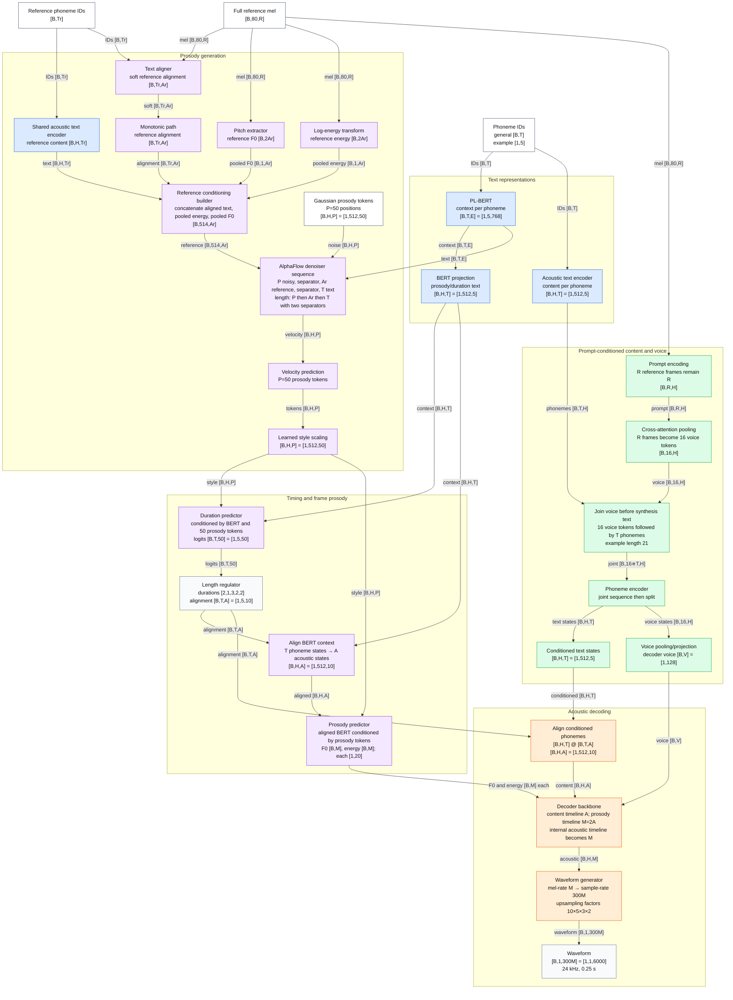

# StyleTTS fine-tuning model architecture

This describes the model assembled by `training/loading.py` at module boundaries.

## Shape notation

Batch dimension `B` is shown everywhere. The base configuration uses the
following dimensions:

| Symbol | Meaning | Base value |
|---|---|---:|
| `T` | padded phoneme-token count | variable |
| `R` | full reference mel frames | variable |
| `Ar` | reference half-rate frames | `R/2` |
| `A` | generated half-rate acoustic frames | `sum(duration)` |
| `M` | generated mel-rate frames | `2A` |
| `S` | waveform samples | `300M` at 24 kHz |
| `H` | text/context width | 512 |
| `E` | PL-BERT width | model-dependent, normally 768 |
| `P` | fixed prosody-token count | 50 |
| `V` | voice-vector width | 128 |
| `K` | RVQ stages | 9 |

Tensor layouts follow the code: token IDs are `[B,T]`; PL-BERT is `[B,T,E]`;
most convolutional features are channel-first `[B,C,time]`; and duration logits
are `[B,T,50]`. A “token” below means a phoneme token unless it is explicitly
called a voice or prosody token.

## Example inference

The example uses `B=1`, `T=5`, durations `[2,1,3,2,2]`, hence `A=10`, `M=20`,
and `S=6,000` samples. The full `R`-frame reference mel is not randomly cut.

`AlphaFlow` does not receive `bert_encoder` output. Its direct synthesis-text
condition is raw PL-BERT `[B,T,E]`. Its reference condition is `[B,514,Ar]`,
composed of aligned reference acoustic-text features `[B,512,Ar]`, half-rate
reference energy `[B,1,Ar]`, and half-rate reference F0 `[B,1,Ar]`. Every part is
therefore derived from the reference utterance through an explicit encoder,
aligner, extractor, or deterministic transform. This design requires the
reference transcript for alignment.

The voice encoder consumes the same full reference mel directly. It converts it
into 16 fixed voice tokens, jointly contextualizes them with the synthesis
phoneme encoding, and returns both the decoder voice vector and the
voice-conditioned per-phoneme content.

## Training architecture

```mermaid
%%{init: {"flowchart": {"defaultRenderer": "elk", "curve": "linear", "nodeSpacing": 28, "rankSpacing": 55}}}%%
flowchart LR
  classDef data fill:#fff,stroke:#475569,color:#111
  classDef model fill:#dbeafe,stroke:#2563eb,color:#111
  classDef latent fill:#f3e8ff,stroke:#9333ea,color:#111
  classDef critic fill:#fee2e2,stroke:#dc2626,color:#111
  classDef loss fill:#fef9c3,stroke:#ca8a04,color:#111
  subgraph INPUTS["Inputs"]
    direction TB
    PH["Phonemes [B,T]"]:::data
    MEL["Target mel [B,80,Mmax]"]:::data
    AUDIO["Target audio [B,1,S]"]:::data
    REF["Full reference mel [B,80,R]"]:::data
  end
  subgraph ENCODE["Encode"]
    direction TB
    TEXT["Acoustic text encoder<br/>T → T states"]:::model
    PLBERT["PL-BERT<br/>T → T contextual states"]:::model
    BPROJ["BERT projection<br/>T states remain T states"]:::model
    ALIGNER["Text aligner<br/>T × Mmax → soft alignment"]:::model
    MPATH["Monotonic path<br/>[B,T,Amax]"]:::model
    PITCH["Fixed pitch extractor<br/>Mmax → Mmax F0 values"]:::model
    ENERGY["Log-energy transform<br/>Mmax → Mmax energy values"]:::model
    POSITION["Position embedding<br/>T positions aligned to Amax"]:::model
    PBUILD["Prosody input builder<br/>concatenate position, F0, energy at Amax"]:::latent
    PENC["Prosody encoder<br/>Amax → P=50 continuous tokens"]:::latent
    RVQ["Optional 9-stage RVQ<br/>P remains 50"]:::latent
    STYLE["Style-source switch<br/>continuous or quantized P tokens"]:::latent
    COND["Reference conditioning builder<br/>concatenate aligned text, pooled energy, pooled F0"]:::latent
    FNOISE["Noisy prosody tokens<br/>P=50 positions"]:::latent
    FSEQ["AlphaFlow denoiser sequence<br/>P tokens, Amax reference frames, T text tokens"]:::latent
    FLOW["Velocity prediction<br/>P=50 positions"]:::latent
    VR["Prompt encoding<br/>R frames remain R frames"]:::model
    VE["Cross-attention pooling<br/>R frames → 16 voice tokens"]:::model
    VJOIN["Join voice tokens before phoneme states"]:::model
    VOICE["Phoneme encoder<br/>joint sequence then split"]:::model
    VOUT["Voice vector"]:::model
    TOUT["T conditioned text states"]:::model
  end
  subgraph PREDICT["Predict and align"]
    direction TB
    DUR["Duration predictor<br/>T states conditioned by P style → [B,T,50]"]:::model
    DCTX["Monotonic alignment<br/>BERT T → Amax states"]:::model
    PROS["Prosody predictor<br/>Amax → Mmax=2Amax F0/energy"]:::model
    CCTX["Soft/monotonic alignment<br/>conditioned text T → Amax states"]:::model
  end
  subgraph OUTPUT["Decode"]
    direction TB
    SWITCH["Stage switch<br/>target or predicted F0/energy"]:::model
    CROP["Synchronized crop<br/>Amax → L; Mmax → 2L"]:::data
    DEC["Decoder backbone<br/>L half-rate frames → 2L mel-rate frames"]:::model
    UPS["Waveform generator<br/>2L mel frames → 600L samples"]:::model
  end
  subgraph SUPERVISION["Training objectives"]
  direction TB
  subgraph OBJECTIVES["Direct"]
    direction TB
    S2SLOSS["Sequence alignment loss"]:::loss
    MONOLOSS["Monotonic alignment loss"]:::loss
    DURL1["Duration L1 loss"]:::loss
    DURCE["Duration categorical loss"]:::loss
    F0LOSS["F0 reconstruction"]:::loss
    ENERGYLOSS["Energy reconstruction"]:::loss
    FLOWLOSS["AlphaFlow velocity loss"]:::loss
    RVQLOSS["RVQ commitment and codebook losses"]:::loss
    MELLOSS["Multi-resolution reconstruction loss"]:::loss
    WAVLMLOSS["WavLM feature loss"]:::loss
    SPEAKERFEATURE["Speaker feature loss"]:::loss
    SPEAKERSIM["Speaker similarity loss"]:::loss
  end
  subgraph ADVERSARIES["Adversarial and factorization objectives"]
    direction TB
    PDISC["Prosody discriminator<br/>real/fake conditioned sequences"]:::critic
    DDISC["Duration discriminator<br/>real/fake conditioned sequences"]:::critic
    MPD["Multi-period discriminator<br/>real/fake waveform"]:::critic
    MSD["Multi-resolution spectral discriminator<br/>real/fake waveform"]:::critic
    WAVELM["WavLM multimodal discriminator"]:::critic
    NUISANCE["Style nuisance heads"]:::critic
    XCOV["Voice/style cross-covariance"]:::critic
  end
  end
  PH -->|"IDs [B,T]"| TEXT
  PH -->|"IDs [B,T]"| PLBERT -->|"context [B,T,E]"| BPROJ
  PH -->|"IDs [B,T]"| ALIGNER
  MEL -->|"mel [B,80,Mmax]"| ALIGNER -->|"soft [B,T,Amax]"| MPATH
  MEL -->|"mel [B,80,Mmax]"| PITCH
  MEL -->|"mel [B,80,Mmax]"| ENERGY
  MPATH -->|"alignment [B,T,Amax]"| POSITION -->|"position [B,512,Amax]"| PBUILD
  PITCH -->|"F0 [B,Mmax]"| PBUILD
  ENERGY -->|"energy [B,Mmax]"| PBUILD -->|"features [B,514,Amax]"| PENC
  PENC -->|"continuous [B,512,P]"| STYLE
  PENC -->|"continuous [B,512,P]"| RVQ -->|"quantized [B,512,P]"| STYLE
  TEXT -->|"text [B,512,T]"| COND
  ALIGNER -->|"soft [B,T,Amax]"| COND
  MPATH -->|"monotonic [B,T,Amax]"| COND
  PITCH -->|"pooled F0 [B,1,Amax]"| COND
  ENERGY -->|"pooled energy [B,1,Amax]"| COND
  STYLE -->|"target [B,512,P]"| FNOISE -->|"noisy [B,512,P]"| FSEQ -->|"velocity [B,512,P]"| FLOW
  COND -->|"reference [B,514,Amax]"| FSEQ
  PLBERT -->|"text [B,T,E]"| FSEQ
  REF -->|"mel [B,80,R]"| VR -->|"prompt [B,R,H]"| VE -->|"voice [B,16,H]"| VJOIN
  TEXT -->|"phonemes [B,T,H]"| VJOIN -->|"joint [B,16⧺T,H]"| VOICE
  VOICE -->|"voice states [B,16,H]"| VOUT
  VOICE -->|"text states [B,H,T]"| TOUT
  BPROJ -->|"context [B,512,T]"| DUR
  STYLE -->|"style [B,512,P]"| DUR
  BPROJ -->|"context [B,512,T]"| DCTX
  MPATH -->|"alignment [B,T,Amax]"| DCTX
  DCTX -->|"aligned [B,512,Amax]"| PROS
  STYLE -->|"style [B,512,P]"| PROS
  TOUT -->|"conditioned [B,512,T]"| CCTX
  MPATH -->|"alignment [B,T,Amax]"| CCTX
  PITCH -->|"target F0 [B,Mmax]"| SWITCH
  ENERGY -->|"target energy [B,Mmax]"| SWITCH
  PROS -->|"predicted pair [B,Mmax] each"| SWITCH
  CCTX -->|"content [B,512,Amax]"| CROP
  SWITCH -->|"prosody pair [B,Mmax] each"| CROP
  CROP -->|"content [B,512,L]; prosody [B,2L]"| DEC -->|"acoustic [B,512,2L]"| UPS
  VOUT -->|"voice [B,128]"| DEC
  ALIGNER -->|"attention [B,T,Amax]"| S2SLOSS
  MPATH -->|"path [B,T,Amax]"| MONOLOSS
  DUR -->|"prediction [B,T,50]"| DURL1
  DUR -->|"logits [B,T,50]"| DURCE
  MPATH -->|"targets [B,T]"| DURL1
  MPATH -->|"targets [B,T]"| DURCE
  PROS -->|"predicted F0 [B,Mmax]"| F0LOSS
  PROS -->|"predicted energy [B,Mmax]"| ENERGYLOSS
  PITCH -->|"target F0 [B,Mmax]"| F0LOSS
  ENERGY -->|"target energy [B,Mmax]"| ENERGYLOSS
  FLOW -->|"velocity [B,512,P]"| FLOWLOSS
  RVQ -->|"errors [K]"| RVQLOSS
  AUDIO -->|"waveform [B,1,S]"| CROP
  CROP -->|"real [B,1,600L]"| MELLOSS
  UPS -->|"fake [B,1,600L]"| MELLOSS
  CROP -->|"real [B,1,600L]"| WAVLMLOSS
  UPS -->|"fake [B,1,600L]"| WAVLMLOSS
  CROP -->|"real [B,1,600L]"| SPEAKERFEATURE
  UPS -->|"fake [B,1,600L]"| SPEAKERFEATURE
  CROP -->|"real embedding [B,Dspk]"| SPEAKERSIM
  UPS -->|"fake embedding [B,Dspk]"| SPEAKERSIM
  PITCH -->|"real F0 [B,Mmax]"| PDISC
  ENERGY -->|"real energy [B,Mmax]"| PDISC
  PROS -->|"fake pair [B,Mmax] each"| PDISC
  TEXT -->|"text [B,512,T]"| DDISC
  MPATH -->|"real duration [B,T]"| DDISC
  DUR -->|"fake duration [B,T]"| DDISC
  CROP -->|"real [B,1,600L]"| MPD
  UPS -->|"fake [B,1,600L]"| MPD
  CROP -->|"real [B,1,600L]"| MSD
  UPS -->|"fake [B,1,600L]"| MSD
  CROP -->|"real WavLM [B,Fw,Dw]"| WAVELM
  UPS -->|"fake WavLM [B,Fw,Dw]"| WAVELM
  VOUT -->|"voice [B,128]"| WAVELM
  STYLE -->|"style [B,512,P]"| NUISANCE
  STYLE -->|"style [B,512,P]"| XCOV
  VOUT -->|"voice [B,128]"| XCOV
```

The decoder crop uses one shared start per item so aligned content, target and
predicted prosody, mel, and waveform remain synchronized. The diagram shows the
intended full-reference voice path. At present, `sample_voice_prompts()` still
selects a random reference segment during training; that call must be removed
when the full-reference input change is implemented.
