# StyleTTS model architecture

Batch is omitted from every shape. In inference, `T` is the padded phoneme length,
`A` is the predicted half-mel timeline, `M = 2A`, and `W = 300M`. In training,
`Mmax` is the batch-padded full mel length and `Amax = Mmax/2`. Reconstruction uses
`L = min(Mmin/2 - 1, max_len/2)`. With the base config `max_len=240`, its random
crop has `C = 2L ≤ 240` mel frames and `600L ≤ 72,000` waveform samples; that bound
is configuration-dependent.

## Inference

```mermaid
%%{init: {"flowchart": {"defaultRenderer": "dagre", "nodeSpacing": 35, "rankSpacing": 55, "curve": "basis"}, "theme": "base"}}%%
flowchart TB
  classDef input fill:#fff,stroke:#334155,color:#111
  classDef text fill:#dbeafe,stroke:#334155,color:#111
  classDef prosody fill:#ede9fe,stroke:#334155,color:#111
  classDef styleNode fill:#fce7f3,stroke:#334155,color:#111
  classDef decoder fill:#dcfce7,stroke:#334155,color:#111
  classDef tensor fill:#f8fafc,stroke:#64748b,color:#111

  TOKENS["Phoneme tokens<br/>[START] [h] [ax] [l] [ow]<br/>runtime prepends START only · <b>T</b>"]:::input

  subgraph SEM["Context and style"]
    direction LR
    BE["<b>bert</b> · PL-BERT embedding<br/>178 → 768<br/><b>T × 768</b>"]:::text
    BA["12× self-attention<br/>12 heads × 64<br/><b>T × 768</b>"]:::text
    BF["12× FFN<br/>768 → 2048 → 768<br/><b>T × 768</b>"]:::text
    BC["Context Cᵦ<br/><b>T × 768</b>"]:::tensor
    Z["Gaussian noise z<br/><b>1 × 256</b>"]:::input
    SIG["Noise level σ<br/>scalar embedding"]:::input
    RM["Trimmed reference voice mel<br/><b>80 × R</b>"]:::input
    RA["<b>style_encoder</b><br/>1×80×R → 64×80×R<br/>→ 512×5×floor(R/16)<br/>Conv5 → pool → <b>128</b>"]:::styleNode
    RP["<b>predictor_encoder</b><br/>1×80×R → 64×80×R<br/>→ 512×5×floor(R/16)<br/>Conv5 → pool → <b>128</b>"]:::prosody
    REF["Voice condition<br/>concat [rₐ;rₚ]<br/><b>256</b>"]:::tensor
    D1["<b>diffusion</b> · replicate noise over T<br/>concat [noise 256; BERT 768]<br/><b>T × 1024</b><br/>+ σ/ref mapping: 1024"]:::styleNode
    D2["3 Transformer blocks<br/>residual width 1024<br/>QKV heads: 8 × 64<br/>FFN 1024→2048→1024"]:::styleNode
    D3["Mean over T: 1×1024<br/>Conv1d 1024 → 256<br/><b>1 × 256</b>"]:::styleNode
    STYLES["Sampled style<br/>acoustic ŝₐ: 128<br/>prosodic ŝₚ: 128"]:::tensor
    BLEND["Reference blending<br/>αŝₐ + (1−α)rₐ: <b>128</b><br/>βŝₚ + (1−β)rₚ: <b>128</b>"]:::tensor
    BE --> BA --> BF --> BC
    Z --> D1
    SIG --> D1
    RM --> RA --> REF
    RM --> RP --> REF
    BC --> D1
    REF -. 256 feature mapping in multispeaker;<br/>passed but ignored in single-speaker .-> D1
    D1 --> D2 --> D3 --> STYLES --> BLEND
    REF --> BLEND
  end

  subgraph DUR["Duration and alignment"]
    direction LR
    BP["<b>bert_encoder</b><br/>Linear 768 → 512<br/><b>T × 512</b>"]:::text
    CAT["Repeat ŝₚ over T<br/>concat 512 + 128<br/><b>T × 640</b>"]:::prosody
    DE1["<b>predictor.text_encoder</b><br/>DurationEncoder block 1<br/>BiLSTM 640 → 256+256<br/>AdaLayerNorm + style"]:::prosody
    DE2["DurationEncoder 2<br/>BiLSTM + AdaLayerNorm<br/><b>T × 640</b>"]:::prosody
    DE3["DurationEncoder 3<br/>BiLSTM + AdaLayerNorm<br/><b>T × 640</b>"]:::prosody
    DL["<b>predictor.lstm</b><br/>640 → 256+256<br/><b>T × 512</b>"]:::prosody
    DP["<b>predictor.duration_proj</b><br/>Linear 512 → 50<br/><b>T × 50</b>"]:::prosody
    DURS["Durations<br/>d̂₁ … d̂ₜ"]:::tensor
    REG["Length regulator<br/>repeat token i by d̂ᵢ<br/>alignment Â: <b>T × A</b>"]:::text
    BP --> CAT --> DE1 --> DE2 --> DE3 --> DL --> DP --> DURS --> REG
  end

  subgraph CONTENT["Acoustic content"]
    direction LR
    TE["<b>text_encoder.embedding</b><br/>178 → 512<br/><b>T × 512</b>"]:::text
    C1["Conv1d block 1<br/>512 → 512 · kernel 5"]:::text
    C2["Conv1d block 2<br/>512 → 512 · kernel 5"]:::text
    C3["Conv1d block 3<br/>512 → 512 · kernel 5"]:::text
    TL["Text BiLSTM<br/>512 → 256+256<br/><b>512 × T</b>"]:::text
    MAT["Alignment product<br/>(512 × T)(T × A)<br/><b>512 × A</b>"]:::text
    TE --> C1 --> C2 --> C3 --> TL --> MAT
  end

  subgraph PROS["Frame prosody"]
    direction LR
    PS["<b>predictor.shared</b><br/>aligned state <b>640 × A</b><br/>BiLSTM 640 → 256+256<br/><b>512 × A</b>"]:::prosody
    F1["<b>predictor.F0</b><br/>AdaIN ResBlock<br/>512 → 512 · time A"]:::prosody
    F2["F0 upsample ResBlock<br/>512 → 256 · A → M"]:::prosody
    F0["Conv1d 256 → 1; squeeze channel<br/>pitch f̂₀: <b>M</b>"]:::tensor
    N1["<b>predictor.N</b><br/>AdaIN ResBlock<br/>512 → 512 · time A"]:::prosody
    N2["Noise upsample ResBlock<br/>512 → 256 · A → M"]:::prosody
    NOISE["Conv1d 256 → 1; squeeze channel<br/>noise n̂: <b>M</b>"]:::tensor
    PS --> F1 --> F2 --> F0
    PS --> N1 --> N2 --> NOISE
  end

  subgraph DEC["Waveform decoder"]
    direction LR
    DB["<b>decoder</b> · DecoderBackbone<br/>content 512×A; F0/noise M→1×A<br/>concat <b>514×A</b> → <b>1024×A</b><br/>acoustic-style AdaIN"]:::decoder
    DR["4 decoder ResBlocks<br/>each concat 1024+64+1+1=<b>1090×A</b><br/>first 3 →1024×A<br/>fourth ↑2 → <b>512×M</b>"]:::decoder
    HUP["NSF F0 upsample<br/>f̂₀: M → <b>300M × 1</b><br/>sample rate 24 kHz"]:::decoder
    HBANK["SineGen harmonic bank<br/>multipliers 1…9 × F0<br/><b>300M × 9</b><br/>phase accumulation · amplitude 0.1"]:::decoder
    HUV["Voiced/unvoiced gate<br/>uv = F0 &gt; 10 Hz<br/><b>300M × 1</b><br/>voiced noise σ=0.003<br/>unvoiced noise σ=0.1/3"]:::decoder
    HMERGE["Merge excitation<br/>gate sines by uv + noise<br/>Linear 9 → 1 + tanh<br/><b>1 × 300M</b>"]:::decoder
    HUNUSED["SourceModule also returns<br/>independent noise <b>1 × 300M</b><br/><b>not consumed by HiFi-GAN forward</b>"]:::tensor
    HPROJ["Scale-specific source projections<br/>Conv stride 30 → <b>256×10M</b><br/>stride 6 → <b>128×50M</b><br/>stride 2 → <b>64×150M</b><br/>1×1 → <b>32×300M</b>"]:::decoder
    U10["ConvTranspose<br/>512 → 256<br/>M → 10M"]:::decoder
    U5["ConvTranspose<br/>256 → 128<br/>10M → 50M"]:::decoder
    U3["ConvTranspose<br/>128 → 64<br/>50M → 150M"]:::decoder
    U2["ConvTranspose<br/>64 → 32<br/>150M → 300M"]:::decoder
    WAV["Conv1d 32 → 1 + tanh<br/>waveform ŷ<br/><b>1 × 300M</b>"]:::tensor
    ISTFT["iSTFTNet alternative<br/>512×M → 256×10M → 128×60M<br/>STFT channels → iSTFT hop 5<br/><b>1 × 300M</b>"]:::decoder
    DB --> DR --> U10 --> U5 --> U3 --> U2 --> WAV
    HUP --> HBANK --> HUV --> HMERGE --> HPROJ
    HUV -.-> HUNUSED
    HPROJ -. source + style-conditioned ResBlock<br/>then additive injection after each ConvTranspose .-> U10
    HPROJ -.-> U5
    HPROJ -.-> U3
    HPROJ -.-> U2
    DR --> ISTFT
  end

  TOKENS --> BE
  TOKENS --> TE
  BC --> BP
  BLEND -. blended prosodic 128 .-> CAT
  REG --> MAT
  DE3 --> PS
  BLEND -. blended prosodic 128<br/>conditions every F0/N AdaIN block .-> PS
  MAT --> DB
  F0 --> DB
  NOISE --> DB
  BLEND -. blended acoustic 128<br/>conditions backbone and all generator ResBlocks .-> DB
  BLEND -. blended acoustic 128 .-> U10
  BLEND -. acoustic style conditions<br/>every source-projection ResBlock .-> HPROJ
  F0 --> HUP
```

## Finetuning

```mermaid
%%{init: {"flowchart": {"defaultRenderer": "elk", "nodeSpacing": 40, "rankSpacing": 60, "curve": "basis"}, "theme": "base"}}%%
flowchart TB
  classDef input fill:#fff,stroke:#334155,color:#111
  classDef model fill:#dbeafe,stroke:#334155,color:#111
  classDef prosody fill:#ede9fe,stroke:#334155,color:#111
  classDef styleNode fill:#fce7f3,stroke:#334155,color:#111
  classDef decoder fill:#dcfce7,stroke:#334155,color:#111
  classDef teacher fill:#fef3c7,stroke:#334155,color:#111
  classDef critic fill:#fee2e2,stroke:#334155,color:#111
  classDef loss fill:#fffbeb,stroke:#b91c1c,color:#111

  subgraph DATA["Paired data, trainable aligner, and fixed pitch teacher"]
    direction LR
    TX["Phoneme IDs x<br/><b>T</b>"]:::input
    MEL["Batch-padded target mel Y<br/><b>80 × Mmax</b>"]:::input
    REFMEL["Same-speaker reference mel<br/>random slice/pad<br/><b>80 × 192</b>"]:::input
    REAL["Full waveform y<br/><b>variable samples</b>"]:::input
    ASR["<b>text_aligner</b><br/>pretrained-initialized ASRCNN<br/>MFCC · stride-2 CNN<br/>6 ConvBlocks · attention<br/><b>trainable and optimizer-stepped</b>"]:::model
    PATH["Maximum path<br/>Aₘₒₙₒ: <b>T × Amax</b><br/>durations d*: <b>T</b>"]:::teacher
    SA["<b>style_encoder</b><br/>per item: <b>1 × 80 × Mᵢ</b><br/>4 ResBlocks ↓2 to 512 channels<br/>pool → sₐ: <b>128</b>"]:::styleNode
    SP["<b>predictor_encoder</b><br/>per item: <b>1 × 80 × Mᵢ</b><br/>independent CNN + pool<br/>sₚ: <b>128</b>"]:::prosody
    JDC["<b>pitch_extractor</b> · fixed JDC<br/>random crop: <b>1 × 80 × 2L</b><br/>channel-squeezed f₀*: <b>2L</b>"]:::teacher
    TX --> ASR
    MEL --> ASR --> PATH
    MEL --> SA
    MEL --> SP
    REFMEL --> RSTYLE["<b>style_encoder + predictor_encoder</b><br/>1×80×192 → 512×5×12 → pool<br/>rₐ:128 + rₚ:128<br/><b>ref: 256</b>"]:::styleNode
  end

  subgraph TSEM["Context and style · same modules as inference"]
    direction LR
    BERT["<b>bert</b><br/>PL-BERT 178 → 768<br/>12 Transformer layers<br/><b>T × 768</b>"]:::model
    DIFF["<b>diffusion</b><br/>target [sₐ;sₚ]: <b>1×256</b><br/>lognormal σ + Gaussian corruption<br/>BERT: <b>T×768</b> · ref: <b>256</b><br/>sample: <b>1×256</b>"]:::styleNode
  end

  subgraph TDUR["Duration and alignment · same predictor as inference"]
    direction LR
    BPROJ["<b>bert_encoder</b><br/>Linear 768 → 512<br/><b>T × 512</b>"]:::model
    PRED["<b>predictor</b><br/>text_encoder: 3 conditioned BiLSTMs<br/>lstm + duration_proj: <b>T×50</b><br/>aligned state: <b>640×Amax</b>"]:::prosody
  end

  subgraph TCONTENT["Acoustic content · same text encoder as inference"]
    direction LR
    TEXT["<b>text_encoder</b><br/>embedding 178 → 512<br/>3 Conv1d + BiLSTM<br/><b>512 × T</b>"]:::model
    ALIGN["Content alignment choice<br/>randomly soft attention or Aₘₒₙₒ<br/>(512×T)(T×Amax)<br/><b>512 × Amax</b>"]:::model
    CROP["Per-item random crop<br/>content: <b>512 × L</b><br/>predictor state: <b>640 × L</b><br/>mel GT: <b>80 × 2L</b><br/>wave GT: <b>1 × 600L</b>"]:::input
    DEAD["Independent crop used to build st<br/>Lst=Mmin/2−1<br/>mel: <b>80×2Lst</b><br/><b>currently unused</b>"]:::input
    TEXT --> ALIGN --> CROP
    CROP -. separate random start .-> DEAD
  end

  subgraph TPROS["Frame prosody · same predictor heads and style encoders as inference"]
    direction LR
    CSTYLE["<b>style_encoder + predictor_encoder</b><br/>crop input: <b>1×80×2L</b><br/>sₐᶜ: <b>128</b> · sₚᶜ: <b>128</b>"]:::styleNode
    F0N["<b>predictor.shared / F0 / N</b><br/>state <b>640×L</b> + sₚᶜ<br/>upsample L→2L<br/>F0: <b>2L</b> · noise: <b>2L</b>"]:::prosody
  end

  subgraph TDEC["Waveform decoder · same decoder and harmonic source as inference"]
    direction LR
    DECODE["<b>decoder</b> · DecoderBackbone<br/>content: 512×L<br/>F0/noise: 2L → 1×L<br/>concat <b>514×L</b><br/>output <b>512×2L</b>"]:::decoder
    HIFI["<b>decoder.generator</b> · HiFi-GAN<br/>F0 2L → 9-harmonic NSF 600L<br/>source at 20L/100L/300L/600L<br/>strides 10·5·3·2<br/>output <b>1×600L</b>"]:::decoder
    FAKE["Generated crop ŷ<br/><b>1 × 600L</b><br/>base-config maximum 72,000"]:::input
    DECODE --> HIFI --> FAKE
  end

    BERT --> BPROJ --> PRED
    BERT --> DIFF
    PRED --> CROP
    CROP --> F0N --> DECODE
    CROP --> JDC
    CROP --> CSTYLE
    CSTYLE -. sₚᶜ conditions every F0/N AdaIN block .-> F0N
    CSTYLE -. sₐᶜ conditions decoder and HiFi-GAN .-> DECODE
    CROP --> DECODE

  TX --> BERT
  TX --> TEXT
  PATH -. alignment .-> PRED
  PATH -. alignment .-> ALIGN
  SP -. prosodic style .-> PRED
  SA -. style target .-> DIFF
  SP -. style target .-> DIFF
  RSTYLE -. multispeaker voice condition .-> DIFF

  subgraph LOSSES["Supervised generator objectives"]
    direction LR
    LD["Duration + alignment<br/>BCE + L1(d̂,d*)<br/>monotonic + S2S"]:::loss
    LP["Crop prosody reconstruction<br/>F0/noise shapes: <b>2L</b><br/>L1(f̂₀,f₀*) + L1(n̂,n*)"]:::loss
    LS["Diffusion + style<br/>denoising objective<br/>L1(ŝ,[sₐ;sₚ])"]:::loss
    LM["Crop waveform reconstruction<br/>real/fake: <b>1 × 600L</b><br/>multi-resolution STFT/mel<br/>feature matching"]:::loss
  end
  PRED -.-> LD
  PRED -.-> LP
  DIFF -.-> LS
  FAKE -.-> LM

  subgraph ADV["Adversarial objectives"]
    direction LR
    MPD["<b>mpd</b> · MultiPeriodDiscriminator<br/>periods 2 · 3 · 5 · 7 · 11<br/>five Conv2d branches"]:::critic
    MSD["<b>msd</b> · MultiResSpecDiscriminator<br/>FFT 1024 · 2048 · 512<br/>three spectral branches"]:::critic
    WLM["Frozen WavLM perceptual loss<br/>real/fake crop: <b>600L</b><br/>main reconstruction step"]:::critic
    AL["Real/fake critic losses<br/>feature-map matching<br/>generator realism gradient"]:::critic
    MPD --> AL
    MSD --> AL
    WLM --> AL
  end
  CROP --> MPD
  CROP --> MSD
  CROP --> WLM
  FAKE --> MPD
  FAKE --> MSD
  FAKE --> WLM

  subgraph SLMADV["Post-joint_epoch SLM adversarial synthesis (separate path)"]
    direction LR
    RT["In-distribution or OOD reference text<br/><b>Rtxt</b>"]:::input
    SD["PL-BERT + diffusion<br/>noise: <b>1×256</b><br/>text: <b>Rtxt×768</b><br/>optional ref features: <b>256</b>"]:::styleNode
    SA2["Predicted durations/alignment<br/><b>Rtxt×50 → Rtxt×Apred</b><br/>content 512×Apred<br/>state 640×Apred"]:::prosody
    SC["SLM crop<br/>90 ≤ Lslm ≤ 100 by base config<br/>content <b>512×Lslm</b><br/>state <b>640×Lslm</b>"]:::input
    SY["F0/N: <b>2Lslm</b><br/>decoder fake: <b>1×600Lslm</b>"]:::decoder
    WD["Frozen WavLM features + decoder conditions<br/><b>wd</b>: six-layer Conformer<br/>WavLM, SEP, global style, F0/energy,<br/>SEP, duration-expanded aligned text<br/>per-token real/fake scores"]:::critic
    RT --> SD --> SA2 --> SC --> SY --> WD
    RSTYLE -. multispeaker features .-> SD
  end

  subgraph VAL["Validation path (different crop contract)"]
    direction LR
    VM["Monotonic alignment only<br/>Lval=Mmin/2−1<br/><b>no max_len cap</b>"]:::input
    VC["content <b>512×Lval</b><br/>state <b>640×Lval</b><br/>mel <b>80×2Lval</b>"]:::model
    VY["F0/noise <b>2Lval</b><br/>wave real/fake <b>1×600Lval</b><br/>duration + STFT + F0 metrics"]:::loss
    VM --> VC --> VY
  end
```

